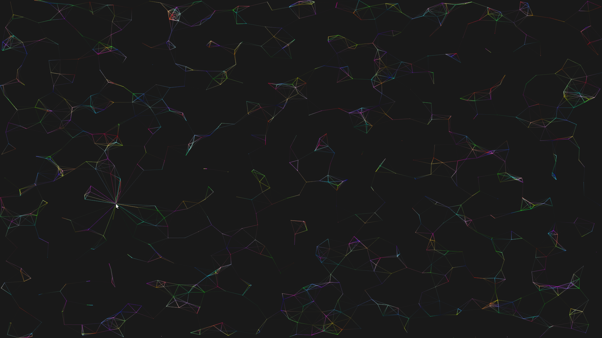
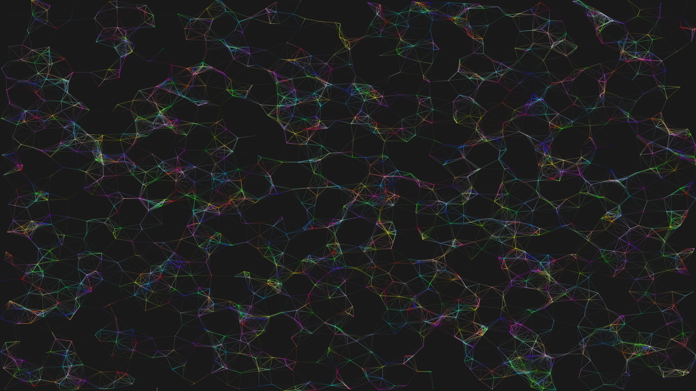
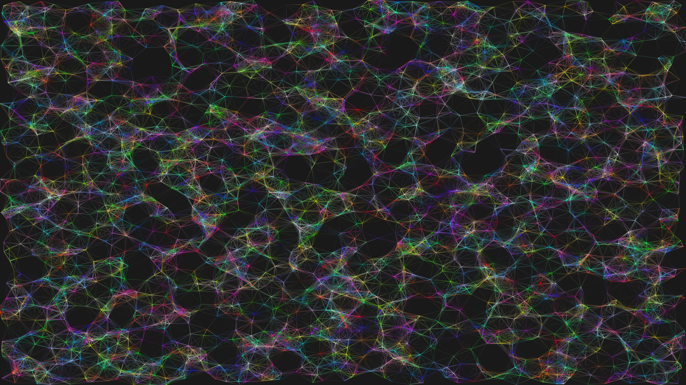
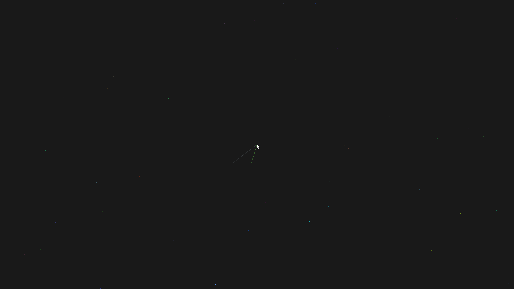
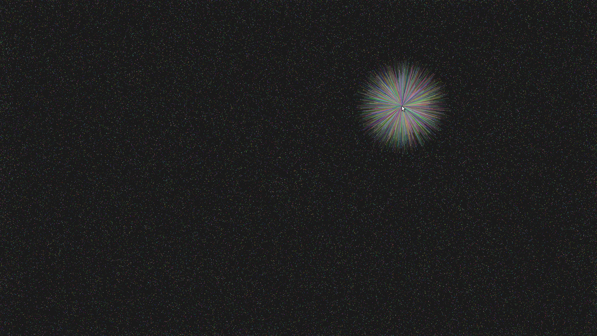

# point-line
A graphic demo about points, lines and mouse cursor.

## Compiling
```Shell
make
```

## Usage
```
Usage   : point-line [OPTION]

Options :
    Rendering objects:
        -b        don't draw lines between nearby points
        -m        don't draw lines between points and mouse cursor
    Rendering arguments:
        -n NUM    set point number
        -s SPEED  set point speed
    Window:
        -d        remove window decoration
        -f        enable fullscreen
        -w SIZE   set window size(for example, 1024x768)
    Others:
        -h        show this help message and exit
        -p        print time information in terminal

Default options(with no options):
    Rendering objects:
        b: draw lines between nearby points
        m: draw lines between points and mouse cursor
    Rendering arguments:
        n: point number is 200
        s: point speed is 1.0
    Window:
        d: enable window decoration
        f: disable fullscreen
        w: window size is 1024x768
    Others:
        h: no help message
        p: don't print time information in terminal
```

With no option, it will run in resolution 1024x768(not fullscreen) with window decoration, drawing 200 points and lines between nearby points as well as lines between points and mouse cursor, not printing time information, and particle speed is 1.0.

## Dependencies
[OpenGL - The Industry's Foundation for High Performance Graphics](https://www.opengl.org/)

[GLFW - An OpenGL library](http://www.glfw.org/)

[GLEW - The OpenGL Extension Wrangler Library](http://glew.sourceforge.net/)

[GLM - OpenGL Mathematics](http://glm.g-truc.net/0.9.6/index.html)

## Examples & Screenshots
```Shell
./point-line -d -f -w 1920x1080 -n 200
```


- - -

```Shell
./point-line -df -w1920x1080 -n1000
```



- - -

```Shell
./point-line -dfw1920x1080 -n2000 -m
```



- - -

```Shell
./point-line -dfw1920x1080 -n4000 -m
```



- - -

```Shell
./point-line -d -f -w 1920x1080 -n 200 -b
```



- - -

```Shell
./point-line -d -f -w 1920x1080 -n 4000 -b
```


- - -

```Shell
./point-line -d -f -w 1920x1080 -n 4000 -b
```



- - -

```Shell
./point-line -d -f -w 1920x1080 -n 100000 -b -m
```


